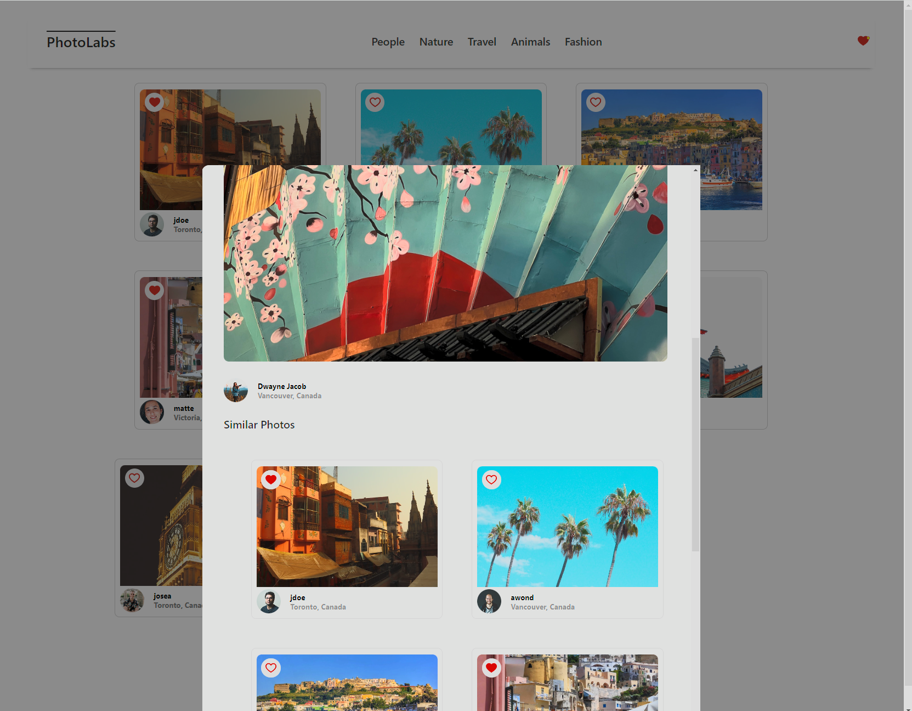
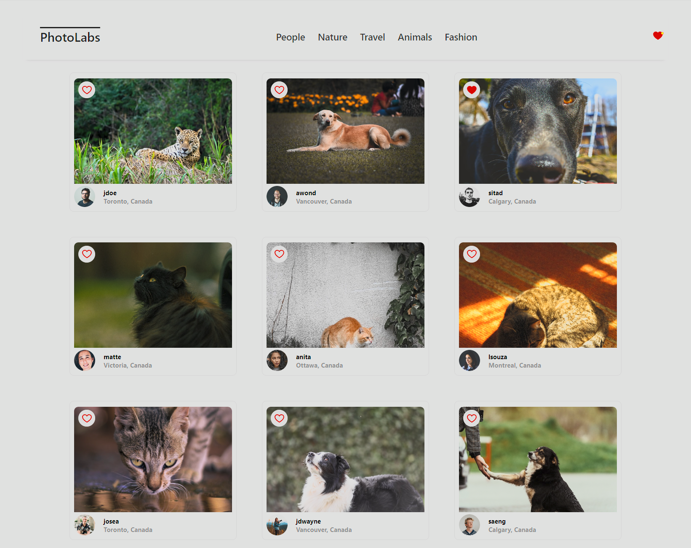

# react-photolabs

Welcome to Photolabs, a beginner developer project that's all about bringing photos to life! This isn't your average photo gallery. We've built a playground for visual exploration that's as simplistic as it is visually stunning.

With a simple click, you can dive into the details of each photo in a slick modal view. This feature was made possible by the power of React, which we used to build our user interface. Thanks to `express` and `pg`, our backend is dynamic and our data is securely stored in a PostgreSQL database.

Whether you're a professional photographer, a casual browser, or a fellow developer looking for inspiration, we hope you enjoy the Photolabs experience!

# Photolabs



## Setup

Install dependencies with `npm install` in each respective `/frontend` and `/backend`.

## Dependencies

### Backend
- `body-parser`
- `cors`
- `dotenv`
- `express`
- `helmet`
- `pg`
- `socket.io`
- `ws`

### DevDependencies
- `jest`
- `supertest`

### Frontend
- `@testing-library/jest-dom`
- `@testing-library/react`
- `@testing-library/user-event`
- `react`
- `react-dom`
- `react-scripts`
- `web-vitals`

### DevDependencies
- `sass`

## [Frontend] Running Webpack Development Server

```sh
cd frontend
npm start
```

## [Backend] Running Backend Servier

Read `backend/readme` for further setup details.

```sh
cd backend
npm start
```
